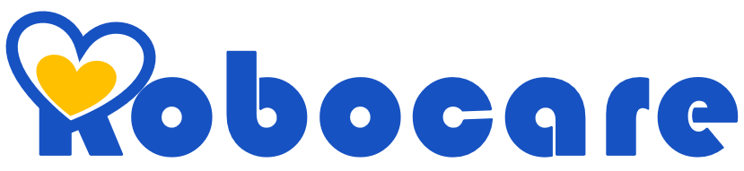

ROBOCON 2020

The Robocare ecosystem is a unique in caring for patients in a _holistic_ fashion by weaving three core concepts of doctor visit scheduling, medication and providing companionship for the patient’s wellbeing. For ROBOCON 2020 Challenge, we successfully designed and built the prototype of our`Medication Module` briefly described below.

`Triage Module` 

`Medication Module`
- medication pipeline from prescription to proper intake
- dynamic and periodic collection of patient feedback

`Companion Module`

